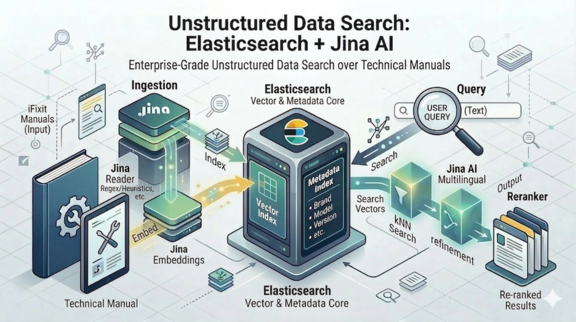
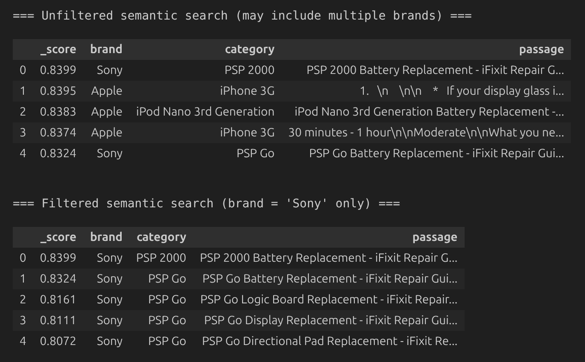
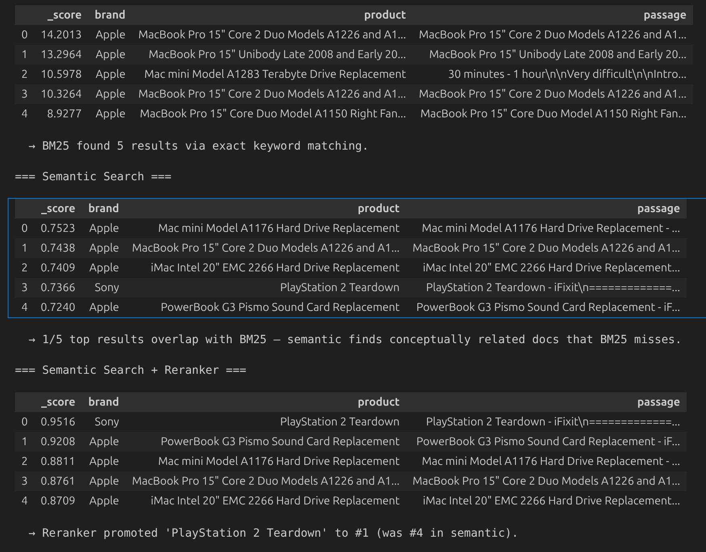
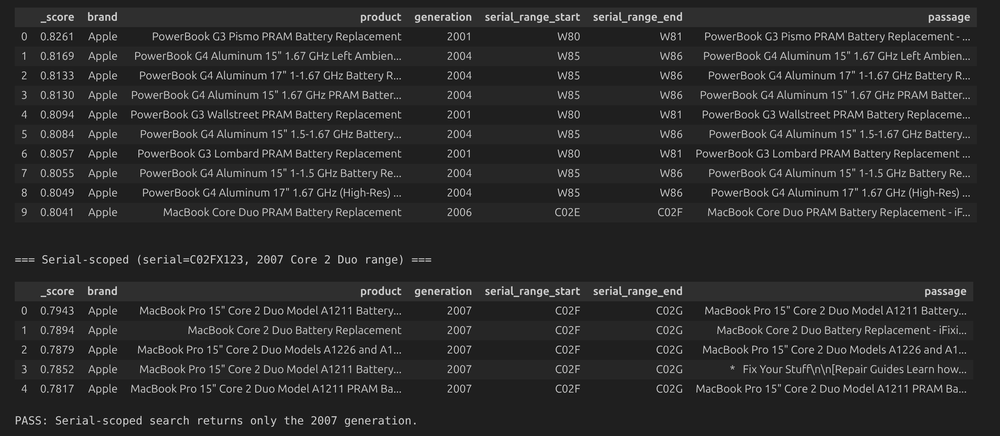
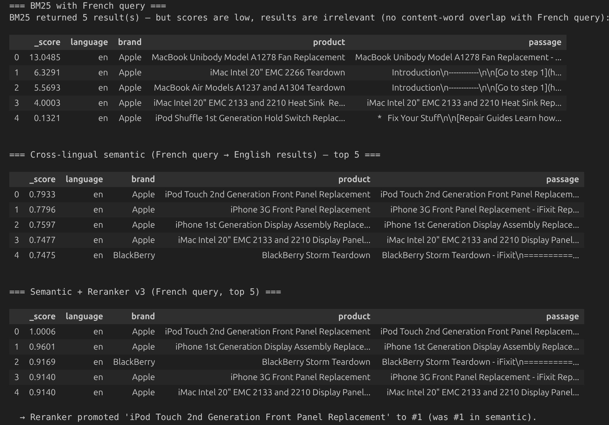

# Unstructured Data Search With Elastic + Jina
*Demonstration of the use of Jina models and Elastic to search technical manuals*

Through the use of Jina models, we can extract both the lexical and semantic details of unstructured data, such as technical manuals.  Indexing that extracted data in Elasticsearch opens up many use cases for these manuals that would not otherwise be accessible.
  
---

## What This Article Covers

- Provisioning an [Elastic Serverless](https://www.elastic.co/cloud/serverless) project via Terraform
- Creating a data set from [iFixit](https://www.ifixit.com/) technical manuals
- Extracting content from those manuals with the [Jina Reader](https://jina.ai/reader/)
- Creating vector embeddings of the manual content with the [Jina embeddings](https://jina.ai/embeddings/) model
- Indexing those tech manual embeddings along with their metadata in Elasticsearch
- Demonstrating the four search scenarios below:
    - Brand Isolation — filter kNN to a single manufacturer
    - Fault Diagnosis — [semantic search](https://www.elastic.co/docs/solutions/search/semantic-search) + reranking vs. BM25
    - Version-Aware / Serial-Scoped Search — [filter](https://www.elastic.co/docs/reference/elasticsearch/rest-apis/filter-search-results) by hardware generation
    - Cross-Lingual Retrieval via Jina multilingual embeddings + reranking — French query → English results

---

## Architecture


- I deploy an Elastic Serverless project via Terraform
- I use the Jina Reader API to extract content from technical manuals
- I use the Jina Embeddings API to create multi-lingual embeddings of that tech manual content
- I use the same Embeddings API + Jina Reranker API, also multi-lingual, in combination with Elasticsearch logic to perform specialized searches on these manuals

---

## Data Collection via iFixit Public API

I use the iFixit REST API to collect 1,000+ guide records. Each record captures: `guideid`, `title`, `category`, `url`, `locale` plus derived fields `brand`, `generation`, and `serial_range_start`/`serial_range_end`.

```python
guide_metadata = []

if GUIDE_URLS_PATH.exists():
    with open(GUIDE_URLS_PATH) as f:
        guide_metadata = [json.loads(line) for line in f]
    print(f"Loaded {len(guide_metadata)} guides from cache.")
else:
    raw_guides = []
    with httpx.Client(timeout=30) as client:
        for offset in tqdm(range(0, 1200, 200), desc="Fetching iFixit pages"):
            resp = client.get(f"{IFIXIT_BASE}/guides", params={"limit": 200, "offset": offset})
            resp.raise_for_status()
            raw_guides.extend(resp.json())

    for g in raw_guides:
        title    = g.get("title", "")
        category = g.get("category", "")
        locale   = g.get("locale", "en")
        brand    = parse_brand(category, title)
        gen      = parse_generation(title, category)
        sr_start, sr_end = parse_serial_range(brand, gen)
        guide_metadata.append({
            "guideid":            g["guideid"],
            "title":              title,
            "category":           category,
            "url":                g.get("url", ""),
            "language":           locale,
            "brand":              brand,
            "generation":         gen,
            "serial_range_start": sr_start,
            "serial_range_end":   sr_end,
        })

    with open(GUIDE_URLS_PATH, "w") as f:
        for rec in guide_metadata:
            f.write(json.dumps(rec) + "\n")

    print(f"Collected {len(guide_metadata)} guides → saved to {GUIDE_URLS_PATH}")
```

---

## Tech Manual Fetch via Jina Reader

I fetch clean Markdown for each guide URL via the Jina Reader API.  That content + the metadata is written to a JSONL file that is subsequently used for indexing.

```python
async def fetch_with_retry(url: str, api_key: str, client: httpx.AsyncClient) -> dict:
    headers = {
        "Authorization":   f"Bearer {api_key}",
        "Accept":          "application/json",
        "X-Retain-Images": "none",
    }
    resp = await client.get(f"https://r.jina.ai/{url}", headers=headers, timeout=20)
    resp.raise_for_status()   # raises HTTPStatusError on 4xx/5xx — tenacity catches it
    return resp.json()
```

---

## Bulk Indexing

Now I index the documents from the JSONL file. The `content` field is typed as `semantic_text`. As such, Elasticsearch calls the Jina inference endpoint to chunk and embed each document at index time. In this case, the endpoint is the Jina Embedding v5 endpoint on [Elastic Inference Service](https://www.elastic.co/docs/explore-analyze/elastic-inference/eis) (EIS). No embedding code needed here.

```python
def iter_actions(docs: list[dict]):
    for doc in tqdm(docs, desc="Indexing"):
        source = {**doc, "content_text": doc["content"]}
        yield {"_index": INDEX_NAME, "_id": doc["doc_id"], "_source": source}

successes, errors = bulk(
        es,
        iter_actions(all_docs),
        raise_on_error=False,
        chunk_size=BATCH_SIZE,
)
print(f"Indexed {successes} documents. Errors: {len(errors)}")
 
es.indices.refresh(index=INDEX_NAME)
print(f"Index '{INDEX_NAME}' now contains {es.count(index=INDEX_NAME)['count']} documents.")
```

---

## Scenario 1 — Brand Isolation

**Query:** `"battery replacement procedure"`

With 91% of the corpus being Apple guides, an unfiltered semantic search for "battery replacement procedure" returns almost exclusively MacBook/iPhone results. Adding a `filter` on the `brand` field pins results to Sony only, demonstrating how filtering rescues minority-brand content from majority-brand saturation.

```python
# --- Unfiltered semantic search via retriever ---
resp_unfiltered = es.search(
    index=INDEX_NAME,
    retriever={
        "standard": {
            "query": {"semantic": {"field": "content", "query": QUERY_S1}},
        }
    },
    size=5
)

# --- Filtered to Sony only via retriever ---
resp_filtered = es.search(
    index=INDEX_NAME,
    retriever={
        "standard": {
            "query":  {"semantic": {"field": "content", "query": QUERY_S1}},
            "filter": {"term": {"brand": TARGET_BRAND}},
        }
    },
    size=5
)
```


---

## Scenario 2 — Fault Diagnosis: BM25 vs. Semantic vs. Reranker

**Query:** `"machine makes grinding noise after startup"`

A technician describing a symptom rarely uses the same words as the repair manual. This query contains no brand, model, or part name — just a vague description of a fault. This exposes the gap between keyword and semantic retrieval:

| Strategy | How it works | What to expect |
|---|---|---|
| **BM25** | Exact token matching on `content_text` | Finds docs containing "grinding", "noise", "machine" literally — may miss conceptually relevant guides that use different words (e.g. "abnormal sound", "fan failure") |
| **Semantic** | Dense vector similarity on `content` | Understands the *concept* of mechanical failure — surfaces relevant guides even without keyword overlap, but ranking is coarse |
| **Reranker** | Cross-attention over semantic top-k | Re-reads each passage against the query with full attention — promotes the most diagnostically relevant result to #1 |


> **Look for:** Different documents and different orderings across strategies. The reranker should promote the most fault-relevant result (e.g. a teardown that discusses mechanical symptoms) above guides that merely mention "noise" or "grinding" in passing.

```python
# --- BM25 only ---
resp_bm25 = es.search(
    index=INDEX_NAME,
    query={"match": {"content_text": QUERY_S2}},
    size=5
)

# --- Semantic only via retriever ---
resp_sem = es.search(
    index=INDEX_NAME,
    retriever={
        "standard": {
            "query": {"semantic": {"field": "content", "query": QUERY_S2}},
        }
    },
    size=20,
)

# --- Semantic + Reranker v3 ---
resp_rerank = es.search(
    index=INDEX_NAME,
    retriever= {
        "text_similarity_reranker": {
            "retriever": {
                "standard": {
                    "query": {"semantic": {"field": "content", "query": QUERY_S2}},
                }
            },
            "field": "content",
            "inference_id": RERANK_ID,
            "inference_text": QUERY_S2,
            "rank_window_size": 5
        }
    }
)
```


---

## Scenario 3 — Version-Aware / Serial-Scoped Search

**Query:** `"battery replacement steps"` + a technician's MacBook serial number

The corpus contains five Apple hardware generations (2001–2009) with serial-range metadata. An unfiltered search returns battery guides spanning all generations — demonstrating cross-generation bleed. Adding a range filter on `serial_range_start` / `serial_range_end` pins results to the single generation matching the technician's serial (`C02FX123` → 2007 Core 2 Duo, range C02F–C02G).

```python
# --- Without serial filter (multiple generations returned) ---
resp_no_filter = es.search(
    index=INDEX_NAME,
    retriever={
        "standard": {
            "query": {"semantic": {"field": "content", "query": QUERY_S3}},
            "filter": {"exists": {"field": "generation"}},
        }
    },
    size=10
)

# --- Serial-scoped ---
resp_serial = es.search(
    index=INDEX_NAME,
    retriever={
        "standard": {
            "query": {"semantic": {"field": "content", "query": QUERY_S3}},
            "filter": {
                "bool": {
                    "must": [
                        {"range": {"serial_range_start": {"lte": TECHNICIAN_SERIAL}}},
                        {"range": {"serial_range_end":   {"gte": TECHNICIAN_SERIAL}}},
                    ]
                }
            },
        }
    },
    size=5
)
```



---

## Scenario 4 — Cross-Lingual Retrieval

**Query (French):** `"l'écran ne répond plus au toucher"` *(the screen no longer responds to touch)*

A technician describes a touchscreen fault in French. The query contains **zero English cognates** — "écran" ≠ "screen", "répond" ≠ "responds", "toucher" ≠ "touch" — so BM25 has no tokens to match against English documents and will return **few or no relevant results**.

`jina-embeddings-v5-text-small` maps 119+ languages into a shared embedding space — no translation needed. The French symptom description retrieves semantically matching English display/screen repair guides purely through cross-lingual vector similarity.

```python
# --- BM25 with French query (few/no relevant results — zero English cognates) ---
resp_bm25_fr = es.search(
    index=INDEX_NAME,
    query={"match": {"content_text": QUERY_S4_FR}},
    size=10,
)

# --- Semantic with French query (cross-lingual) via retriever ---
resp_sem_fr = es.search(
    index=INDEX_NAME,
    retriever={
        "standard": {
            "query": {"semantic": {"field": "content", "query": QUERY_S4_FR}},
        }
    },
    size=10,
    aggs={"by_language": {"terms": {"field": "language", "size": 10}}},
)

# --- Semantic + Reranker v3 ---
resp_rerank_fr = es.search(
    index=INDEX_NAME,
    retriever= {
        "text_similarity_reranker": {
            "retriever": {
                "standard": {
                    "query": {"semantic": {"field": "content", "query": QUERY_S4_FR}},
                }
            },
            "field": "content",
            "inference_id": RERANK_ID,
            "inference_text": QUERY_S4_FR,
            "rank_window_size": 5,
        }
    },
    source_excludes=["content.inference.chunks.embeddings"],
)
```


---
## Source Code

The full source is available here:

https://github.com/joeywhelan/unstructured-es

---